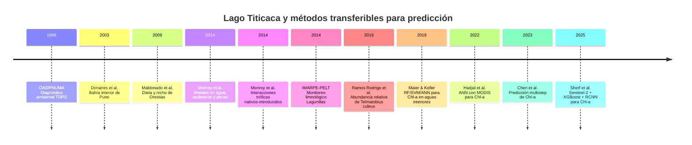
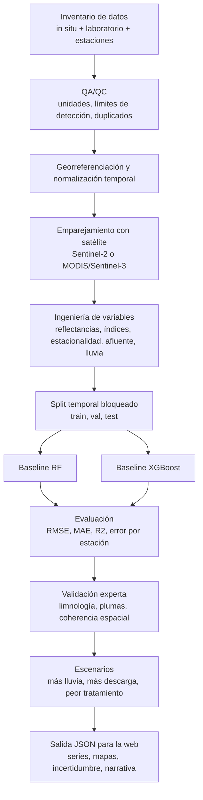

# Estado del arte sobre predicción de contaminación y efectos ambientales en el Lago Titicaca

## Resumen ejecutivo

La evidencia disponible hasta junio de 2026 sugiere una conclusión muy clara: en el Lago Titicaca existe **mucho más trabajo de diagnóstico, monitoreo ecológico y evaluación de impactos** que de **predicción operativa** en sentido estricto. El corpus accesible y verificable está dominado por reportes binacionales/ambientales sobre focos de contaminación, estudios de metales en agua-sedimento-biota, y trabajos sobre biodiversidad y declive de especies emblemáticas; en comparación, los papers específicamente orientados a *forecasting* de contaminación o eutrofización para el Titicaca son escasos y, en el material indexado accesible, no aparecen con la misma solidez metodológica y trazabilidad que los estudios descriptivos. citeturn51view1turn58view0turn50view3turn64view0turn69view0

Eso no significa que el proyecto no tenga sentido. Significa algo más útil: **el mejor baseline replicable para Titicaca hoy no es intentar predecir metales pesados desde satélite**, sino construir una primera herramienta en torno a **clorofila‑a / riesgo de eutrofización**, apoyada por teledetección y validada con datos in situ; en paralelo, los contaminantes específicos —metales, aguas residuales, coliformes, nutrientes, pesticidas— deberían modelarse inicialmente con un enfoque **in situ + covariables hidrometeorológicas y de cuenca**, porque la observación satelital capta bien señales ópticas superficiales, pero capta muy mal contaminantes disueltos específicos salvo por proxies indirectos. citeturn58view2turn64view1turn42academia8turn57academia3turn42academia6

También hay suficiente evidencia para sostener un enfoque de “efectos ecológicos” más allá de la mera química del agua. El daño se expresa en eutrofización creciente en la bahía interior de Puno, en acumulación de metales en peces por encima de umbrales de consumo recomendados, en alteraciones de comunidades nativas de peces, y en la fuerte contracción de poblaciones de la rana gigante del Titicaca, un organismo muy sensible a contaminación, eutrofización y pérdida de hábitat. citeturn58view2turn64view1turn64view0turn69view2turn69view3

Para un producto periodístico o de divulgación con costo moderado, la mejor estrategia es escalonada: **primero un baseline visual y reproducible** de clorofila‑a/riesgo trófico; después un baseline **híbrido** con datos in situ de nutrientes/oxígeno/descargas; y solo como tercera etapa, si la base de datos existe y está limpia, un modelo multisalida con escenarios de descargas, lluvia y caudales. Además, la arquitectura editorial del especial ya contempla un espacio de “proyección ambiental” y visualizaciones narrativas, por lo que una salida JSON simple para web y escenarios contrafactuales encaja muy bien con el formato del producto. fileciteturn0file0

## Corpus y estudios clave

El estado del arte relevante puede separarse en dos bloques: **evidencia local del Titicaca** y **métodos transferibles** desde la literatura reciente de predicción de calidad de agua/chlorophyll retrieval. El primer bloque responde bien a la pregunta “qué está ocurriendo y dónde”; el segundo bloque responde mejor a la pregunta “qué conviene replicar como baseline técnico”. citeturn51view1turn64view0turn69view0turn42academia8turn57academia3turn42academia6

### Tabla comparativa de estudios clave

| Estudio | Objetivo | Variable objetivo | Método | Datos usados | Desempeño reportado | Aplicabilidad para replicación |
|---|---|---|---|---|---|---|
| **Diagnóstico Ambiental del Sistema TDPS** (OAS/PNUMA, 1996) | Diagnóstico binacional del sistema Titicaca‑Desaguadero‑Poopó‑Salar | Contaminación hídrica, salud pública, ecosistemas, fuentes domésticas/mineras | Síntesis ambiental, inventario, evaluación temática y pronóstico ambiental | Compila información previa del sistema TDPS; cobertura binacional; no expone un dataset tabular único con *n* consistente | No aplica como modelo predictivo; sí identifica focos y tendencias | **Muy alta** como marco causal y para definir variables mínimas; útil para justificación y diseño de indicadores. citeturn51view1turn58view0turn58view2turn58view3 |
| **Donaires et al.** (2003) *Contaminación de las aguas del Lago Titicaca en la bahía interior de Puno* | Documentar contaminación de la bahía interior de Puno | Eutrofización/contaminación orgánica | Reporte técnico-conferencia | Metadatos accesibles vía referencia secundaria; el documento indexado accesible no mostró en esta revisión el detalle de *n* y tabla original | No recuperado en fuente indexada accesible | **Alta** como antecedente histórico de la bahía de Puno, pero **baja** para réplica exacta si no se consigue el PDF original. citeturn50view2turn50view3 |
| **Monroy, Maceda‑Veiga, de Sostoa** (2014) *Metal concentration in water, sediment and four fish species from Lake Titicaca reveals a large-scale environmental concern* | Cuantificar contaminación por metales y riesgo alimentario | Metales en agua, sedimento y 4 especies de peces | Muestreo ambiental + análisis químico comparativo | Agua, sedimento y cuatro especies de peces del Titicaca; georreferenciación lacustre; el *n* exacto no aparece en el extracto indexado visible | No es paper de predicción; hallazgo central: concentraciones altas con implicaciones de salud/ecología | **Muy alta** para definir targets químicos prioritarios y para justificar una capa de riesgo alimentario/ecológico. DOI: **10.1016/j.scitotenv.2014.03.134**. citeturn50view3turn64view1 |
| **Maldonado et al.** (2009) *Morphology–diet relationships in four killifishes from Lake Titicaca* | Relacionar morfología y dieta en peces nativos | Dieta/nicho ecológico | Ecología funcional comparativa | Cuatro killifish del Titicaca; detalle *n* no visible en el extracto indexado | No aplica a predicción de contaminación; sí a sensibilidad ecológica por nicho | **Media**: útil para interpretar impacto ecológico diferencial entre zonas/taxones. DOI: **10.1111/j.1095-8649.2008.02140.x**. citeturn64view2 |
| **Monroy et al.** (2014) *Trophic interactions between native and introduced fish species in a littoral fish community* | Evaluar presión ecológica por especies introducidas | Interacciones tróficas/comunidad litoral | Ecología trófica | Comunidad litoral del Titicaca; detalle *n* no visible en el extracto indexado | No es predictor químico; sí explica deterioro ecológico combinado | **Media**: muy útil para una capa narrativa de “efecto ecológico” junto a contaminación. DOI: **10.1111/jfb.12529**. citeturn64view0turn64view3 |
| **Ramos Rodrigo, Quispe Coila, Elias Piperis** (2019) *Evaluación de la abundancia relativa de Telmatobius culeus en la zona litoral del lago Titicaca, Perú* | Medir abundancia relativa de rana gigante del Titicaca | Ocurrencia/abundancia relativa | Transectos litorales | El resumen secundario recuperado indica 3 transectos de 100×2 m en 38 localidades; 45 individuos en 6 localidades en 2017 | No es predictor químico; funciona como indicador biológico de estado | **Alta** para integrar biomarcadores/ecological endpoints. DOI: **10.15381/rpb.v26i4.17216**. citeturn69view0turn69view2 |
| **IMARPE‑PELT** (2014) *Monitoreo ecológico y limnológico de la Laguna de Lagunillas, Lampa‑Puno* | Monitoreo limnológico/ecológico de cuerpo conectado a la cuenca Titicaca | Variables limnológicas/ecológicas | Monitoreo técnico | Reporte de 53 pp.; laguna conectada a cuenca Coata→Titicaca; no es lago principal | No reporta métricas predictivas | **Media‑alta** como fuente de protocolos y estructura de bases de datos regionales. DOI/handle de difusión: **10.13140/RG.2.1.1592.6004**. citeturn67view0 |
| **Maier & Keller** (2019) *Estimating Chlorophyll a Concentrations of Several Inland Waters with Hyperspectral Data and Machine Learning Models* | Estimar clorofila‑a con ML | Clorofila‑a | RF, SVM, ANN sobre datos hiperespectrales | 13 cuerpos de agua interiores; campañas de campo con espectrómetro + Chl‑a in situ | R² entre **0.80–0.90** según modelo/resolución | **Muy alta** como baseline de regresión para Titicaca si hay matchups satélite‑campo. citeturn42academia8 |
| **Hadjal et al.** (2022) *An Artificial Neural Network Algorithm to Retrieve Chlorophyll a... from Ocean Colour Reflectance* | Recuperar clorofila‑a desde reflectancia | Clorofila‑a | Red neuronal sobre 15 bandas MODIS‑Aqua | Periodo 2002–2020; reflectancia visible e IR; aguas costeras/turbias | Mejora frente a algoritmos regionales clásicos; más disponibilidad de datos | **Alta** como referencia metodológica para MODIS/Sentinel‑3, sobre todo en aguas turbias. citeturn57academia3 |
| **Chen et al.** (2023) *Multi-step prediction of chlorophyll concentration...* | Predicción multistep de clorofila | Clorofila‑a futura | Graph‑Temporal ConvNet + descomposición de series | Series temporales multivariadas de calidad de agua | Mejor que comparadores del estudio; el abstract accesible no detalla cifras completas | **Media**: interesante solo en una fase ambiciosa, cuando ya exista serie temporal densa y estable. citeturn42academia7 |
| **Sherf et al.** (2025) *Global Chlorophyll‑a Retrieval algorithm from Sentinel‑2...* | Recuperación global de Chl‑a con ML + residual CNN | Clorofila‑a | Clasificador de agua + XGBoost + RCNN | **13,626** *matchups* con AquaMatch USGS; **867** masas de agua; Sentinel‑2 | **R² = 0.79**, **MAE = 13.52 mg/m³**, pendiente **0.91** | **Muy alta** como baseline ambicioso y moderno si se dispone de matchups locales para ajuste/validación. citeturn42academia6 |

### Fichas de lectura crítica

El reporte OAS/PNUMA de 1996 sigue siendo una pieza sorprendentemente útil para diseño de variables porque identifica, con lenguaje casi de ingeniería de sistemas, los focos dominantes: contaminación orgánica y bacteriológica por aguas residuales en la bahía interior de Puno; descargas de Juliaca al Coata; descargas parciales de El Alto al río Seco; y una trayectoria de eutrofización creciente en Puno. No es un paper de predicción, pero sí un excelente mapa causal. Además, ya contiene un capítulo explícito de **pronóstico de la situación ambiental** y otro sobre **futuro de la salud pública**, lo que lo hace conceptualmente cercano a lo que ustedes quieren convertir en herramienta. citeturn58view0turn58view2turn58view3

El paper de Monroy, Maceda‑Veiga y de Sostoa de 2014 es probablemente la referencia académica más fuerte y más directamente relevante para el eje “toxicidad/polución”. Su aportación no es predictiva sino de **evidencia química dura**: agua, sedimento y cuatro especies de peces, con resultados consistentes con una preocupación ambiental de gran escala y con riesgo para consumo humano en especies nativas e introducidas. Es exactamente el tipo de evidencia que justifica una futura capa de “riesgo toxicológico” o “seguridad alimentaria” en la herramienta, pero no sirve como baseline de forecasting satelital. citeturn50view3turn64view1

Los trabajos ecológicos sobre peces nativos y sobre la rana gigante son valiosos porque permiten evitar un error muy común en proyectos de visualización ambiental: reducir todo a una variable fisicoquímica. En Titicaca, la contaminación interactúa con especies introducidas, sobrepesca, eutrofización y pérdida de hábitat. Por eso tiene sentido que el producto final no muestre solo una línea de predicción de clorofila, sino también una capa de “impacto ecológico esperable” sobre totorales, peces nativos y anfibios emblemáticos. citeturn64view2turn64view3turn69view0turn69view3

## Corrientes metodológicas

La corriente metodológica más fuerte y replicable para un primer producto es la de **predicción/estimación de clorofila‑a mediante teledetección + ML**. En la literatura reciente, los trabajos con mejor desempeño y mayor transferibilidad combinan reflectancia multibanda con modelos flexibles —RF, SVM, ANN, XGBoost y arquitecturas híbridas— y superan con frecuencia a los algoritmos de razón de bandas fijos en aguas interiores y turbias. Los casos más claros del corpus revisado son Maier & Keller 2019, Hadjal et al. 2022 y Sherf et al. 2025. citeturn42academia8turn57academia3turn42academia6

En contraste, la predicción de **contaminantes específicos** como As, Pb, Cd, Hg, pesticidas o coliformes tiene un patrón totalmente diferente. Esos targets dependen de procesos de fuente‑transporte‑transformación mucho menos visibles ópticamente: geología local, relaves y pasivos mineros, descargas puntuales, caudales, dilución, resuspensión, química del pH y, en algunos casos, eventos de lluvia. En Titicaca, la evidencia disponible muestra que esos contaminantes sí están presentes y son importantes, pero el corpus local accesible no muestra todavía una tradición robusta de modelos predictivos operativos para ellos. Por eso, un modelo “desde satélite” para metales pesados sería metodológicamente débil como primera versión. citeturn58view1turn64view1turn70view0

Sobre sensores, la distinción útil no es “in situ versus satélite” como una dicotomía, sino **qué variable puede observar cada uno sin excesiva inferencia**. Los sensores in situ siguen siendo indispensables para metales, nutrientes reactivos, coliformes, oxígeno disuelto, pH, conductividad y biomarcadores biológicos. La teledetección es muy buena para **clorofila‑a, color del agua, turbidez superficial, extensión de macrófitas/totora, manchas algales y tal vez algunos proxies de plumas de descarga**, especialmente con Sentinel‑2 y, a otra escala espacial, con MODIS/VIIRS/Sentinel‑3. En términos prácticos: el satélite ve mejor el **estado óptico superficial** del lago; el laboratorio ve mejor la **toxicidad específica**. citeturn42academia8turn57academia3turn42academia6turn57search0

A nivel ecológico, la literatura verificable del Titicaca también sugiere una segunda corriente importante: usar organismos o comunidades como **endpoints biológicos**. La abundancia relativa de *Telmatobius culeus*, la composición trófica de *Orestias*, la presencia de peces introducidos y la condición de macrófitas/totorales no sustituyen la química del agua, pero sí transforman una señal ambiental abstracta en una señal ecológicamente interpretable. Para una herramienta de divulgación seria, esto es crucial. citeturn69view0turn69view2turn64view2turn64view3

## Vacíos y riesgos de validación

El vacío más obvio es la **escasez de benchmarks locales realmente predictivos, bien documentados y reproducibles** para el lago principal. Eso obliga a un diseño más honesto: usar el Titicaca para la **definición del problema**, y usar la literatura internacional de aguas interiores para la **arquitectura del baseline**. No es una concesión metodológica menor; en realidad es una forma correcta de evitar sobreprometer. citeturn51view1turn42academia8turn57academia3turn42academia6

El segundo vacío es de datos: muchos documentos locales son reportes, capítulos o PDFs históricos, pero no ofrecen —al menos en el material accesible indexado— una base tabular limpia con fecha, coordenadas, profundidad, método analítico, QA/QC y límites de detección. Para ML serio, eso es más importante que la elección entre RF y XGBoost. Si no existe una tabla unificada, el mayor trabajo no será modelar, sino **reconstruir el dataset**. citeturn51view1turn67view0

Los riesgos metodológicos principales son cuatro. El primero es **leakage temporal**: entrenar con registros mezclados aleatoriamente cuando el proceso realmente cambia con estación lluviosa/seca, descargas y tendencias de años. El segundo es **leakage espacial**: meter en train y test puntos prácticamente colocalizados o estaciones vecinas, y después interpretar el resultado como capacidad de generalización. El tercero es el **target mismatch**: pretender predecir metal disuelto con bandas ópticas que solo observan color/turbidez. El cuarto es la **validación sin experto**: una métrica razonable puede seguir generando mapas físicamente absurdos si nadie revisa consistencia hidrológica, plumas, vientos o descargas. Estas recomendaciones son inferencias metodológicas consistentes con el comportamiento observado en series multivariadas y con el contraste entre estudios químicos directos y papers de recuperación óptica de clorofila. citeturn58view2turn64view1turn42academia7turn42academia6turn57academia3

En el caso Titicaca, además, hay un riesgo narrativo específico: **confundir causalidad**. Un aumento de clorofila‑a puede estar asociado a nutrientes y aguas residuales, pero no prueba por sí mismo presencia alta de metales pesados; del mismo modo, una pluma visible no cuantifica por sí sola arsénico o cadmio. La herramienta debería evitar mensajes del tipo “el satélite detectó metales”, salvo que se explicite que se trata de proxies o escenarios inferidos. citeturn58view1turn64view1turn42academia8turn57academia3

## Baselines replicables para el proyecto

Lo más sensato es pensar en tres baselines de complejidad creciente.

| Opción | Qué entrega | Tiempo estimado | Datos mínimos | Riesgo técnico |
|---|---|---:|---|---|
| **Mínimo esfuerzo** | Mapa temporal de riesgo trófico / eutrofización por zonas, con regla simple o RF binario | **2–3 semanas** | Fechas, coordenadas, clorofila‑a o proxy local, turbidez/Secchi, 1–2 años de series | Bajo |
| **Medio** | Regresión de clorofila‑a con Sentinel‑2 + datos in situ + explicación por variables y escenarios simples | **3–4 semanas** | Matchups satélite‑campo; Chl‑a, DO, turbidez, temperatura, lluvia, estación, coordenadas | Medio |
| **Ambicioso** | Sistema híbrido multisalida: clorofila‑a, riesgo de eutrofización, alertas por afluentes/descargas y capa ecológica | **4–6+ semanas** | Todo lo anterior + nutrientes, coliformes, descargas, metales, caudales, validación experta | Alto |

La opción de **mínimo esfuerzo** consiste en no forzar una regresión continua cuando aún no se sabe si el etiquetado es consistente. Si las observaciones son escasas o heterogéneas, es mejor clasificar riesgo en categorías como *bajo / medio / alto* usando clorofila‑a, transparencia, oxígeno y proximidad a afluentes/descargas. Para un especial periodístico, esto ya produce una visualización útil y defendible. citeturn58view2turn42academia8

La opción **media** es la mejor relación esfuerzo/valor. Es la que más se parece a lo que tendría sentido publicar pronto: un modelo de Chl‑a con Sentinel‑2 o mosaicos multitemporales, calibrado con datos in situ y evaluado en un corte temporal real. A nivel de estado del arte, esta ruta está mucho mejor respaldada que cualquier intento inicial de modelar metales desde imaginería. citeturn42academia8turn57academia3turn42academia6

La opción **ambiciosa** solo tiene sentido si el laboratorio o la red de aliados realmente pueden entregar una base histórica rica: nutrientes, coliformes, metales, descargas, caudales, lluvia, viento y validación por limnólogo/hidrobiólogo. Sin esa densidad, la complejidad adicional solo produciría un dashboard vistoso pero epistemológicamente débil. citeturn51view1turn58view3turn64view1

### Datos mínimos que conviene pedir desde el inicio

Pediría, como mínimo, una tabla maestra con: `station_id`, `datetime`, `lat`, `lon`, `depth_m`, `chlorophyll_a`, `secchi_m`, `turbidity_ntu`, `do_mg_l`, `water_temp_c`, `ph`, `conductivity`, `nh4`, `no3`, `po4`, `tn`, `tp`, `bod`, `cod`, `fecal_coliforms`, `as`, `pb`, `cd`, `hg`, `zn`, `cu`, `cr`, `lab_method`, `detection_limit`, `qa_flag`, `sampling_agency`. Si existe además lluvia, viento, caudal y localización de descargas puntuales, mejor todavía. Esta lista no es arbitraria: responde a los problemas dominantes del lago reportados por OAS/PNUMA y a las variables que la literatura de clorofila y eutrofización suele explotar con mejor transferencia. citeturn58view2turn58view1turn42academia8turn42academia6

## Pipeline técnico propuesto

### Timeline de publicaciones y maduración metodológica



La lectura de esta línea temporal es importante. La literatura **local** madura primero en diagnóstico e impacto ecológico; la literatura **predictiva** madura fuera del Titicaca, sobre todo en clorofila‑a. Ese desacople es precisamente la razón por la que el baseline recomendado debe ser transferible, no localista a toda costa. citeturn51view1turn50view3turn64view2turn69view0turn42academia8turn57academia3turn42academia6

### Flujo recomendado de datos



### Pseudocódigo de preprocesamiento y *split* temporal

```python
from __future__ import annotations

import pandas as pd
import numpy as np

def load_and_clean(path: str) -> pd.DataFrame:
    df = pd.read_csv(path)

    # Fechas y coordenadas
    df["datetime"] = pd.to_datetime(df["datetime"], utc=True, errors="coerce")
    df = df.dropna(subset=["datetime", "lat", "lon"])

    # Estandarización simple
    numeric_cols = [
        "chlorophyll_a", "secchi_m", "turbidity_ntu", "do_mg_l",
        "water_temp_c", "ph", "conductivity", "nh4", "no3", "po4",
        "tn", "tp", "bod", "cod"
    ]
    for col in numeric_cols:
        if col in df.columns:
            df[col] = pd.to_numeric(df[col], errors="coerce")

    # Flags QA/QC
    if "qa_flag" in df.columns:
        df = df[df["qa_flag"].isin(["OK", "ok", "validated", "VALID"])]

    # Variables temporales
    df["year"] = df["datetime"].dt.year
    df["month"] = df["datetime"].dt.month
    df["dayofyear"] = df["datetime"].dt.dayofyear

    # Ejemplo: estación lluviosa aproximada
    df["wet_season"] = df["month"].isin([12, 1, 2, 3]).astype(int)

    return df.sort_values("datetime").reset_index(drop=True)


def temporal_split(
    df: pd.DataFrame,
    train_end: str,
    val_end: str
) -> tuple[pd.DataFrame, pd.DataFrame, pd.DataFrame]:
    train_end = pd.Timestamp(train_end, tz="UTC")
    val_end = pd.Timestamp(val_end, tz="UTC")

    train = df[df["datetime"] <= train_end].copy()
    val = df[(df["datetime"] > train_end) & (df["datetime"] <= val_end)].copy()
    test = df[df["datetime"] > val_end].copy()

    if train.empty or val.empty or test.empty:
        raise ValueError("Split temporal inválido: revisa las fechas y la cobertura.")

    return train, val, test
```

### Baseline práctico con Random Forest y XGBoost

```python
from __future__ import annotations

from typing import Sequence
import numpy as np
import pandas as pd

from sklearn.compose import ColumnTransformer
from sklearn.pipeline import Pipeline
from sklearn.impute import SimpleImputer
from sklearn.metrics import mean_absolute_error, mean_squared_error, r2_score
from sklearn.ensemble import RandomForestRegressor

# Requiere: pip install xgboost
from xgboost import XGBRegressor


def rmse(y_true: np.ndarray, y_pred: np.ndarray) -> float:
    return float(np.sqrt(mean_squared_error(y_true, y_pred)))


def build_features(df: pd.DataFrame, target: str):
    leak_cols = {"datetime", target}
    feature_cols = [c for c in df.columns if c not in leak_cols]

    numeric_cols = [c for c in feature_cols if pd.api.types.is_numeric_dtype(df[c])]
    # Para un first pass conviene evitar categorías complejas; se pueden añadir luego.
    pre = ColumnTransformer(
        transformers=[
            ("num", Pipeline([
                ("imputer", SimpleImputer(strategy="median"))
            ]), numeric_cols)
        ],
        remainder="drop"
    )
    X = df[feature_cols]
    y = df[target].astype(float)
    return X, y, pre


def evaluate_model(name: str, model, X_train, y_train, X_val, y_val, X_test, y_test):
    model.fit(X_train, y_train)

    pred_val = model.predict(X_val)
    pred_test = model.predict(X_test)

    return {
        "model": name,
        "val_mae": mean_absolute_error(y_val, pred_val),
        "val_rmse": rmse(y_val, pred_val),
        "val_r2": r2_score(y_val, pred_val),
        "test_mae": mean_absolute_error(y_test, pred_test),
        "test_rmse": rmse(y_test, pred_test),
        "test_r2": r2_score(y_test, pred_test),
    }


def train_baselines(train: pd.DataFrame, val: pd.DataFrame, test: pd.DataFrame, target="chlorophyll_a"):
    X_train, y_train, pre = build_features(train, target)
    X_val, y_val, _ = build_features(val, target)
    X_test, y_test, _ = build_features(test, target)

    rf = Pipeline([
        ("pre", pre),
        ("model", RandomForestRegressor(
            n_estimators=400,
            max_depth=None,
            min_samples_leaf=2,
            random_state=42,
            n_jobs=-1
        ))
    ])

    xgb = Pipeline([
        ("pre", pre),
        ("model", XGBRegressor(
            n_estimators=500,
            max_depth=6,
            learning_rate=0.05,
            subsample=0.8,
            colsample_bytree=0.8,
            objective="reg:squarederror",
            random_state=42
        ))
    ])

    results = [
        evaluate_model("RF", rf, X_train, y_train, X_val, y_val, X_test, y_test),
        evaluate_model("XGBoost", xgb, X_train, y_train, X_val, y_val, X_test, y_test),
    ]

    return pd.DataFrame(results).sort_values("test_rmse")
```

### Generación de escenarios simples

```python
from __future__ import annotations
import pandas as pd

def build_scenarios(df_latest: pd.DataFrame) -> pd.DataFrame:
    """
    Escenarios simples y comunicables para la web.
    Asume que df_latest contiene el último estado por estación.
    """
    scenarios = []

    for _, row in df_latest.iterrows():
        base = row.to_dict()

        # Escenario 1: +20% en turbidez / pluma
        s1 = base.copy()
        s1["scenario"] = "pluma_intensificada"
        if "turbidity_ntu" in s1 and pd.notna(s1["turbidity_ntu"]):
            s1["turbidity_ntu"] *= 1.2
        scenarios.append(s1)

        # Escenario 2: +15% en nutrientes
        s2 = base.copy()
        s2["scenario"] = "aporte_nutrientes_alto"
        for col in ["nh4", "no3", "po4", "tn", "tp"]:
            if col in s2 and pd.notna(s2[col]):
                s2[col] *= 1.15
        scenarios.append(s2)

        # Escenario 3: mitigación moderada
        s3 = base.copy()
        s3["scenario"] = "mitigacion_moderada"
        for col in ["nh4", "no3", "po4", "tn", "tp", "turbidity_ntu", "bod", "cod"]:
            if col in s3 and pd.notna(s3[col]):
                s3[col] *= 0.85
        scenarios.append(s3)

    return pd.DataFrame(scenarios)
```

### Formato JSON para la web

```json
{
  "lake": "Titicaca",
  "model_version": "baseline_xgb_v1",
  "target": "chlorophyll_a",
  "units": "mg/m3",
  "generated_at": "2026-06-08T18:00:00Z",
  "train_period": ["2022-01-01", "2024-12-31"],
  "validation_period": ["2025-01-01", "2025-06-30"],
  "test_period": ["2025-07-01", "2026-03-31"],
  "metrics": {
    "mae": 3.2,
    "rmse": 5.1,
    "r2": 0.74
  },
  "locations": [
    {
      "station_id": "PUNO_BAHIA_01",
      "lat": -15.84,
      "lon": -70.02,
      "date": "2026-03-15",
      "prediction": 18.4,
      "uncertainty": 2.1,
      "risk_level": "alto",
      "drivers": ["tn", "tp", "turbidity_ntu", "wet_season"],
      "scenario_outputs": {
        "baseline": 18.4,
        "pluma_intensificada": 22.1,
        "aporte_nutrientes_alto": 24.6,
        "mitigacion_moderada": 13.3
      }
    }
  ]
}
```

### Métricas que sí conviene reportar

Para una salida periodística seria, yo reportaría **MAE, RMSE y R²** en test temporal, pero también dos métricas más narrativamente útiles: error por estación/zona y error por temporada lluviosa vs seca. Si el modelo es de clasificación de riesgo, entonces F1 macro y matriz de confusión por zona. Lo importante no es ganar unas décimas en R², sino demostrar que el modelo no solo memoriza la bahía de Puno y luego fracasa fuera de ella. Esto es una recomendación metodológica derivada del tipo de heterogeneidad espacial que muestran Titicaca y sus afluentes. citeturn58view2turn42academia6turn42academia7

## Limitaciones y preguntas abiertas

La principal limitación de esta revisión es documental: varias referencias locales importantes aparecen en metadatos secundarios, páginas de índice o referencias bibliográficas, pero **no todas ofrecen en abierto y de forma indexada el detalle completo de muestras, georreferenciación, variables y métricas**. Eso afecta especialmente a reportes técnicos históricos y a parte de la literatura local no anglosajona. He priorizado lo que sí pude verificar con alta confianza y he marcado como incompleto lo que no pude reconstruir de manera responsable. citeturn50view2turn51view1turn67view0

También queda abierta una cuestión clave para el proyecto: si existe ya, en el drive o en instituciones aliadas, una serie histórica suficientemente consistente de **clorofila‑a** o **nutrientes** con coordenadas y fechas exactas. Si la respuesta es sí, el baseline medio es altamente viable. Si la respuesta es no, entonces el baseline correcto es uno más austero: clasificación de riesgo y visualización de focos, no predicción cuantitativa continua. Esa decisión no es cosmética; define el alcance real de las próximas 3–4 semanas. citeturn42academia8turn42academia6turn58view2

Por último, una advertencia conceptual: el Titicaca es un sistema donde contaminación, hidrología, especies introducidas y cambio de uso del suelo interactúan. Por eso la mejor herramienta no será “un predictor único de contaminación”, sino una **interfaz multi‑capa**: estado óptico del agua, presión de afluentes, riesgo ecológico y, cuando la base lo permita, riesgo toxicológico. Esa arquitectura es mucho más fiel al estado del arte que un número único pretendidamente totalizador. citeturn51view1turn64view3turn69view3turn43news2